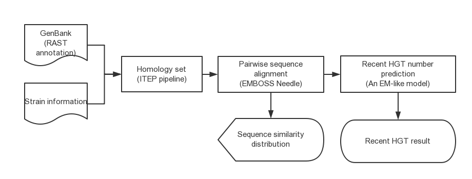

# RecentHGT

**Using an Expectation Maximization (EM) algorithm to detect recent horizontal gene transfer (HGT)
between bacterial species and strains.**

## Installation

The easiest way to use RecentHGT is to download the source code and unpack it.

You will also need to install the other dependencies before running the scripts.

I suggest the users have a knowledge of the command line or bioinformatics. If not, this strategy may not be suitable for you. 

### Dependencies:
* Python 2.7 or 3.6
* BioPython
* R > 3.10
* ggplot2
* fitdistrplus
* [BLAST+ CLI](https://blast.ncbi.nlm.nih.gov/Blast.cgi?PAGE_TYPE=BlastDocs&DOC_TYPE=Download)
* [EMBOSS](http://emboss.sourceforge.net/)
* [pyani](https://github.com/widdowquinn/pyani)
* [ITEP](https://github.com/mattb112885/clusterDbAnalysis)

## Usage

### Input

#### Preparing a text file contains the information of all query strains
Complete genome will be preferred but the draft genome is all OK for HGT detecting. 

Currently, RecentHGT is only suitable for Bacteria and Archaea. Although I has the potential to deal with fungi and other eukaryote.  

As shown in example_data directory, you need give these files before running:

* strain_info.txt

        No.   Strain  RastID  Chromosome  pSym
        1	IE4771	379.111	CP006986.1	CP006988.1
        2	IE4803	379.112	CP007641.1	CP007643.1
        3	Mim1	379.125	NC_021905.1	NC_021909.1
        4	CFN42	379.140	NC_007761.1	NC_004041.2
        ......
    
    It worth to note that you'd better use run the example data to get a clear understanding of this package.
    You can change the Chromosome and pSym to your interested genomic replicons or you can just ignore these two columns.

> Chromosome and symbiotic plasmid (pSym) were used in my research. So you can change 
these to other replicons or just delete them.
 
* [RAST](http://rast.nmpdr.org/) annotated genbank files located in genbank directory
#### Building the pan-genome

+ First, please follow the [tutorial](https://github.com/mattb112885/clusterDbAnalysis) of ITEP pipeline to build the pan-genome of your input genomes.
+ Then, you can use `fetch_pairwise_genome.py` located in `src/` directory to fetch all homologous genes of every strain pair. 
+ Putting all homologous genes every strain pair into a directory named `strain_pair_OG`.
+ Putting `strain_info.txt`, `strain_pair_OG` and `genbank` into a input directory.
       
### Running recentHGT

#### Pipeline


You can get a summary of available command-line options with `recentHGT.py -h`

```
$ python recentHGT.py -h
usage: average_nucleotide_identity.py [-h] [-o OUTDIRNAME] [-i INDIRNAME] 
                                      [-v VERBOSE] [-t THREADS] [-p PART]
                                      [-l LOGFILE] [-f FORCE] [--noclobber] 
                                      [-g DISPLAYFORMAT]
[…]
```
You can simply use this command to finish all 4 steps automatically:
```
python recentHGT.py -i example_data -o example_out -v -l log.txt -p 0
```
Else, you can run each step by step respectively:
> Step 1: USing pyani program to calculate the ANI value of each strain pair.
```
python recentHGT.py -i example_data -o example_out -v -l log.txt -p 1
```
> Step 2: USing Needle program to do pairwise sequence alignment.
```
python recentHGT.py -i example_data -o example_out -v -l log.txt -p 2
```
> Step 3: Drawing similarity distribution pictures.
```
python recentHGT.py -i example_data -o example_out -v -l log.txt -p 3
```
> Step 4: Inferring the number of recent HGT genes.
```
python recentHGT.py -i example_data -o example_out -v -l log.txt -p 4
```
> Step 5: Drawing the comparison between the number of recent HGT genes and specific 
location genes (chromosome and plasmid genes). Please make sure you have prepared the input strain information file. Else,
you can just ignore this step.
```
python recentHGT.py -i example_data -o example_out -v -l log.txt -p 5
```
### Output
> Step 1: There will be a directory named ANIm containing the output files from pyani program.

> Step 2: The alignment results will be packed `strain_pair_OG_alignment.tar.gz`

> Step 3: There will be two directories named `strain_pair_result` and `strain_result` separately.
>> `strain_pair_result` contains the pairwise alignment of each strain pair
>> `strain_result` contains the combination results for each query strain and the empirical distributions.

> Step 4: Estimated numbers of the recent HGT genes of all strain pairs will be saved 
in a text file named `recent_HGT_results.txt`.

> Step 5: A directory named `combined_results` will be output containing the pictures displaying the number of recent HGT genes 
and Chromosomal and Plasmid genes.
### Troubleshooting
+ RecentHGT is still in developing now. So I just finished to implement the core components. 
+ Please, if you have any problem during the installation and use of RecentHGT. Please feel free to leave your questions in Issues. I will try my best to help you.
+ Also, if you have any suggestions or ideas, please tell me in Issues. I will be very grateful.